# demo_feeds_reader assignment

## Architecture
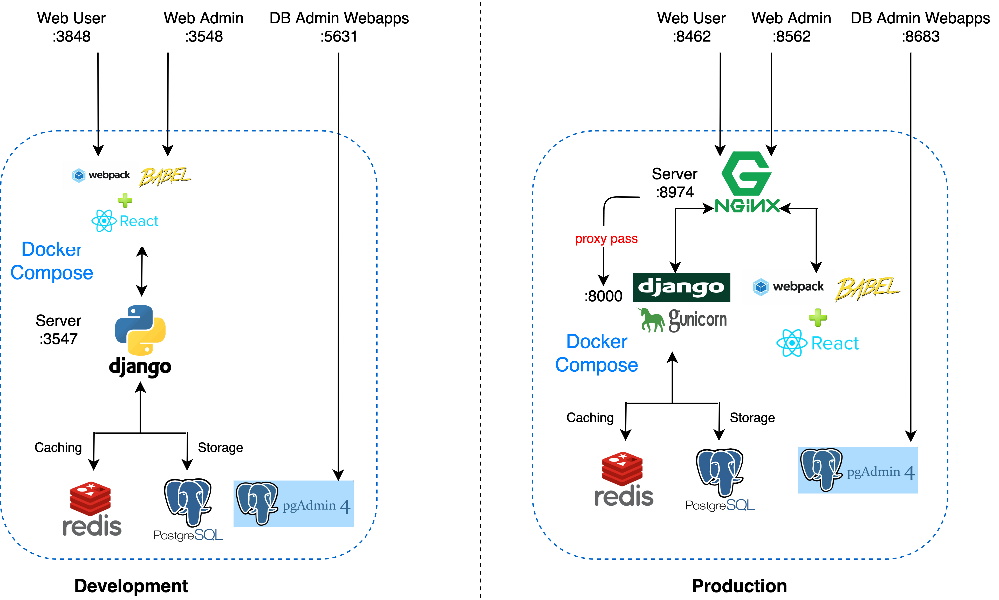
## Flow chart
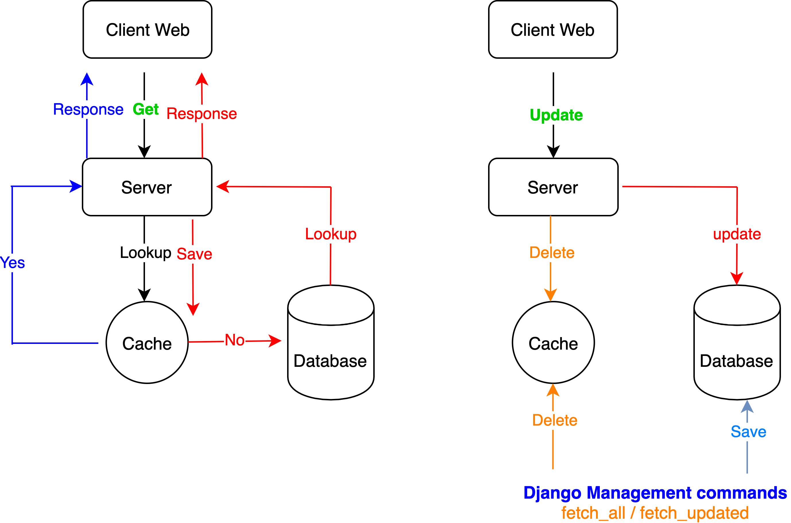

## Credentials
- All credentials are stored in `.env`: `<source_dir>/_deployment_docker_compose/.env`

## Demo Online
- [Client Web - Admin](http://62.171.174.135:8562): http://62.171.174.135:8562
- [Client Web - User](http://62.171.174.135:8462): http://62.171.174.135:8462
- [Database Web Admin (PgAdmin)](http://62.171.174.135:8683): http://62.171.174.135:8683
    - Login: email: `pgadmin-production@pgadmin.pgadmin`  password: `344rdost5rwegrfdg`
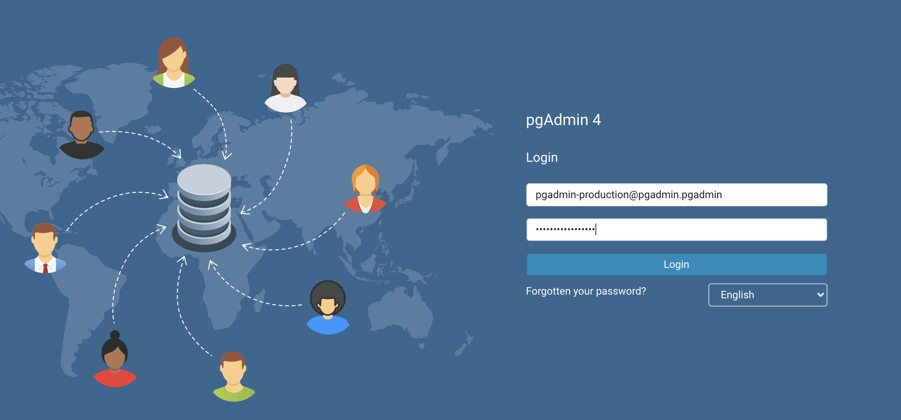    
    - Postgres password: `adGZda9Ab2kN`    
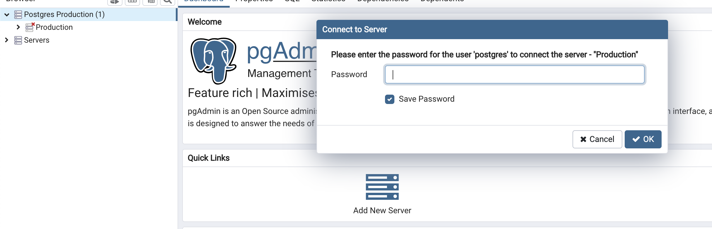
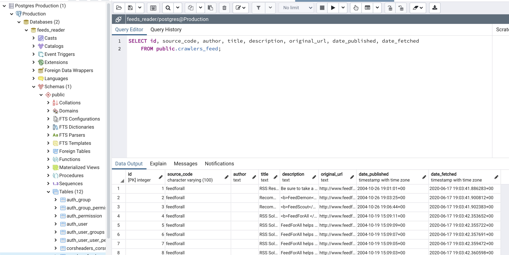        
         


## Source code
```
.
└── _deployment
│    ├── docker_compose                         # docker compose configuration
│    └── logs                                   # store logs of server backend, docker compose services... 
│
└── client
│    └── mobile_app                             # reserve for Mobile App
│    └── web_common                             # Code shared between Web Admin & User
│    └── web_admin                              # Code for Web Admin
│    └── web_user                               # Code for Web User
│    └── ....                                   # env, Dockerfile...
│
└── server
    ├── api
    │    ├── admin                              # for Client - Web Admin
    │    └── user                               # for Client - Web User
    │
    ├── crawlers
    │    ├── management
    │    │      ├── commands                    # fetch_all / fetch_update
    │    │      ├── ... 
    │    ├── migrations                         # django migration files
    │    ├── sites
    │    │      ├── feedforall
    │    │      │       ├── __init__.py
    │    │      │       ├── settings.py
    │    │      │       └── site.py
    │    │      ├── washingtonpost
    │    │      │       ├── __init__.py
    │    │      │       ├── settings.py         # settings for site
    │    │      │       └── site.py             # implement base_site.py 
    │    │      ├── base_function.py
    │    │      └── base_site.py                # astract class for Site
    │    │ 
    │    ├── models.py                          # models for crawlers
    │    ├── tests.py                           # unit test
    │    └── ...
    ├── feeds_reader                            # settings
    │        ├── settings.py                    # FEED_SITES: define list of Sites
    │        └── ...
    │
    ├── utils                                   # common functions
    ├── ...
    ├── run_fetch_all.sh                        # run in Server Container
    ├── run_tests.sh                            # run in Server Container
    └── ...                       
```

## Deployment
- Checkout and change to source code directory: `<source_dir>`
- Change dir to `docker_compose`: `cd <source_dir>/_deployment/docker_compose`
- Configuration can be examined in `.env` file

### 1) For Development

- `./dc_up_development_1st_time.sh` : Run once in 1st time in order to initialize the Database Postgres. If successfully, you will see these messages
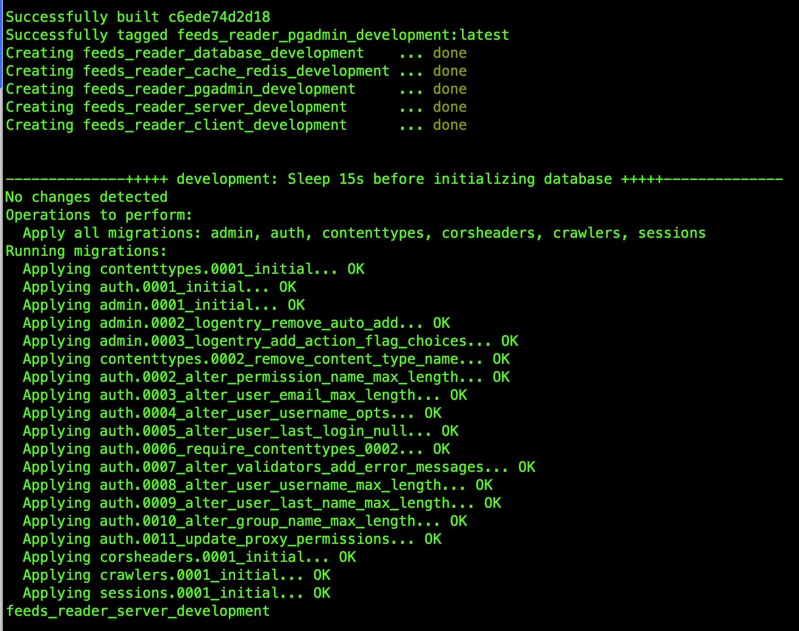

- `./dc_up_development.sh` : anytime while in development
- Hot reloading are applied to 
    - Client Web (User & Admin) `ReactJS` by `Webpack Dev Server`
    - Server `Django` by `manage.py runserver`
- Checking:
    - [Client Web - User](http://localhost:3848) (not implemented, only show simple text): http://localhost:3848
    - [Client Web - Admin](http://localhost:3548): http://localhost:3548
    - [Server](http://localhost:3547/api/admin/feed/?filterKeyword=&page=1&pageSize=5): Check if backend server is ready or not `http://localhost:3547/api/admin/feed/?filterKeyword=&page=1&pageSize=5`
    if you see the json  `{"feeds": [], "totalPage": 1, "totalFeed": 0, "status": "success"}`, then it works.
    - [Database Web Admin (PgAdmin)](http://localhost:5631): http://localhost:5631
### 2) For Production
Similar to "Development", we have 2 bash scripts
- `./dc_up_production_1st_time.sh`
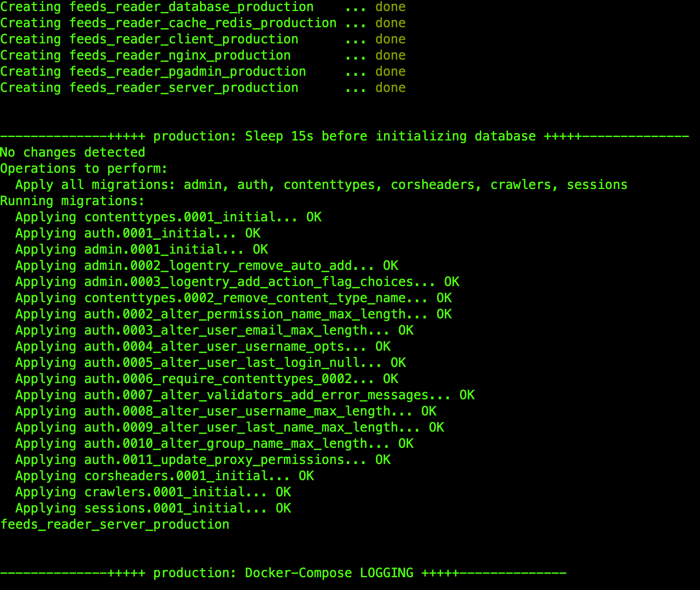
- `./dc_up_production.sh`
- Components specs:
    - Client Web (User & Admin) `ReactJS`: built by `Webpack` to `dist` dir in Docker Image `feeds_reader_client_production`, and served as `Static files` by `nginx`
    - Server `Django`: run by `gunicorn`
- Checking:
    - [Client Web - User](http://localhost:8462): http://localhost:8462
    - [Client Web - Admin](http://localhost:8562): http://localhost:8562
    - [Server](http://localhost:8974/api/admin/feed/?filterKeyword=&page=1&pageSize=5): Check if backend server is ready or not `http://localhost:8974/api/admin/feed/?filterKeyword=&page=1&pageSize=5`
    - [Database Web Admin (PgAdmin)](http://localhost:8683): http://localhost:8683         


## Run Django commands
### * Note
In the following paragraphs, `<env>` will be replace for `development` or `production` 
### 1) Fetch the feeds
- Enter the server container `docker exec -it feeds_reader_server_<env> bash` 
- Example when run `fetch_all` in `development`:
    - `docker exec -it feeds_reader_server_development bash` 
    - `/opt/app/run_fetch_all.sh` ~ `python /opt/app/manage.py fetch_all --sites washingtonpost,feedforall`
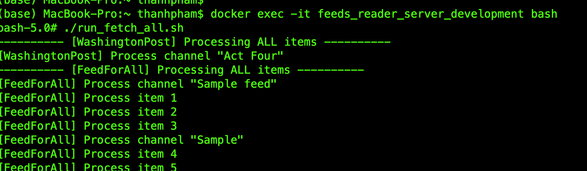  
    - Fetch with limitation per site: `python /opt/app/manage.py fetch_all --sites washingtonpost,feedforall --limit 5`
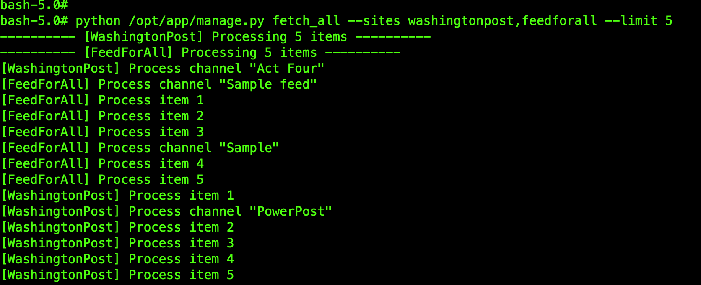
- NOTE: Multiple sites can be run simultaneously by Python Threading processing
- There is also `fetch_updated` command (but not implemented)
- More details: `<source_dir>/server/crawlers/management/commands`
- Visit the Client Web Admin to see the feeds http://localhost:3548 (`development`)
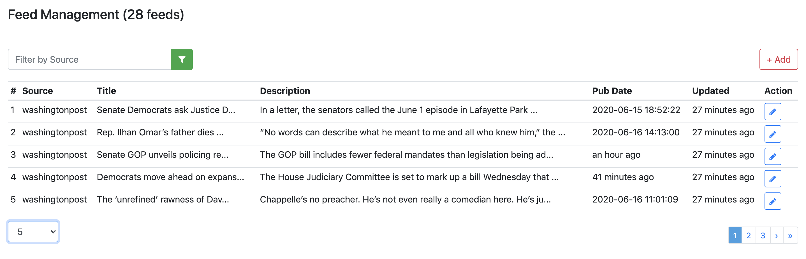
### 2) Run test
Enter the server container, then execute `/opt/app/run_test.sh`
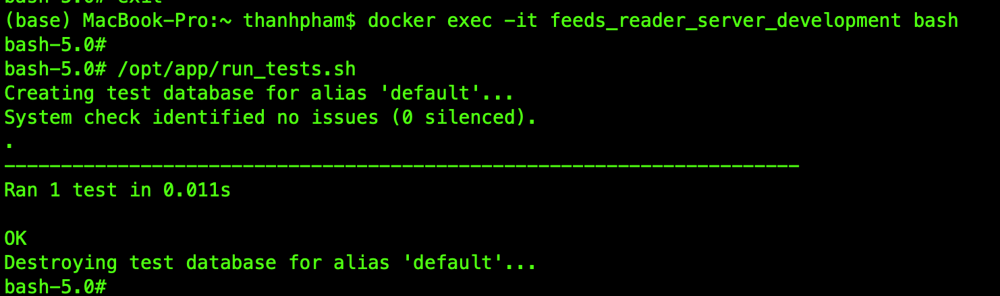

## Add new Site
In the source code, we predefined 2 sites: `washingtonpost` and `feedforall`. Here are steps if you want to add a new site:
- In `<source_dir>/server/feeds_reader/settings.py`, add a new one, for example `crawlers.sites.newsite`
```.env
# Fetched Sites
FEED_SITES = [
    'crawlers.sites.washingtonpost',
    'crawlers.sites.feedforall',
    'crawlers.sites.newsite'            # added
]
```
- Make new directory  `<source_dir>/server/crawlers/sites/newsite`
```
.
└── server
    │
    └── crawlers
         │
         └── sites
                └── newsite
                        ├── __init__.py
                        ├── settings.py
                        └── site.py
                             
```
## View logs
When running commands in section `Run Django commands`, you can view logs of Backend server:
- Assume you are in Host Machine (Your PC, not inside Docker Container), and yoy are in `development`
- Run command: `tail -f <source_dir>/_deployment/logs/development/server_backend/debug.log`
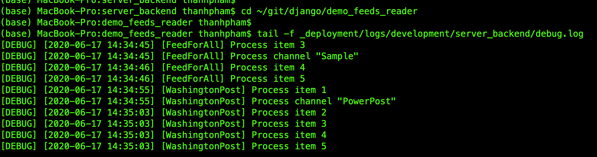

## Git Branches
We have 4 types of branch:
- `Master`: for production
- `Staging`: Release-Candidate version, almost like Production
- `Testing`: For testing environment `(Not implement in this assignment)`
- `Development`: For development, fork from here and then merge to Testing -> Staging
    - Whenever we want to make a new feature we will fork from this "Development branch"
    - For example: branch `feature_server`, `feature_client_admin` ...
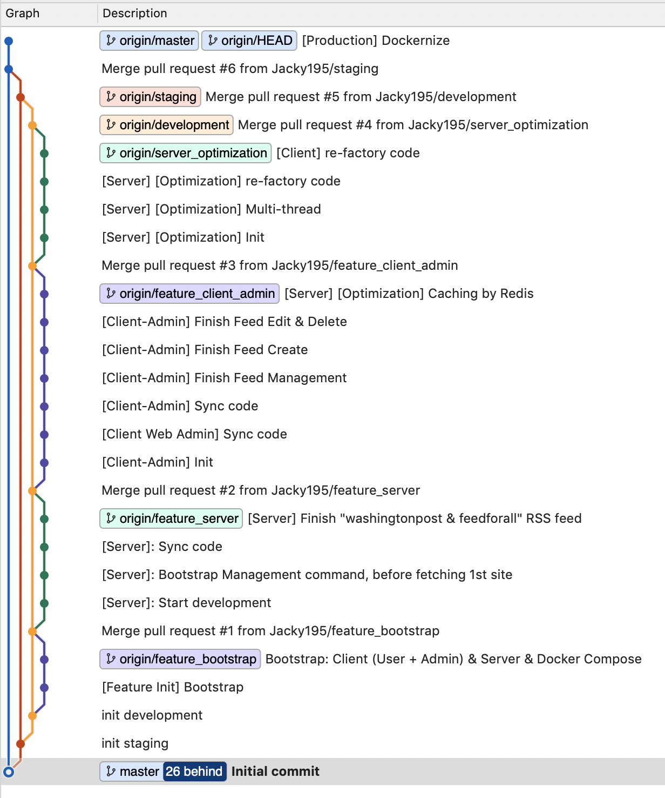     